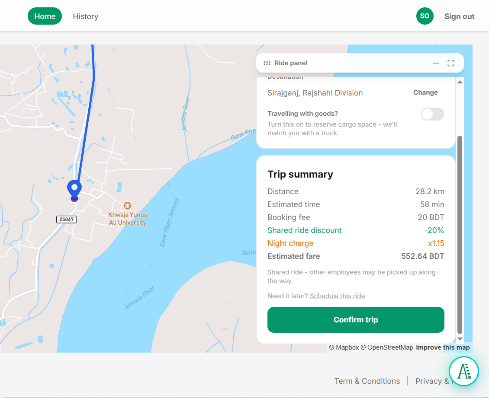
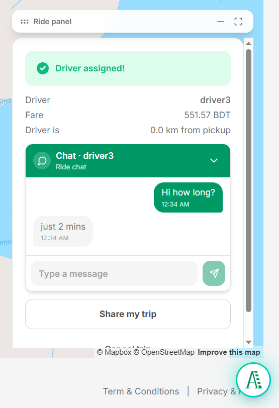
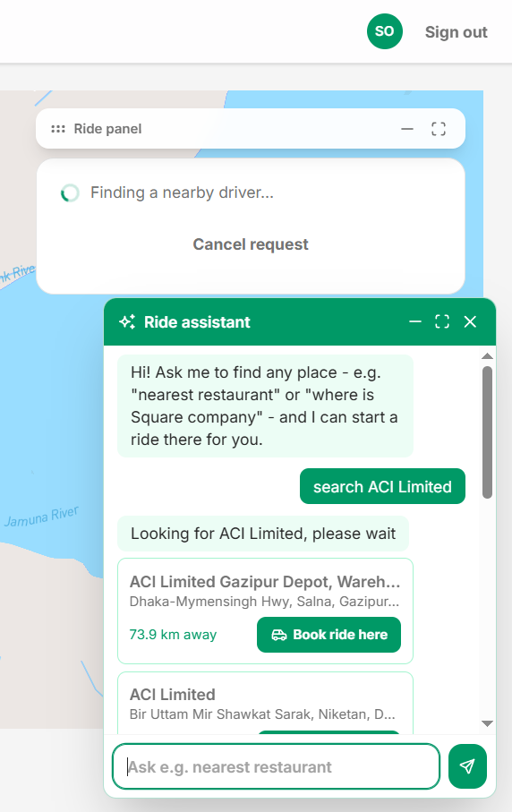
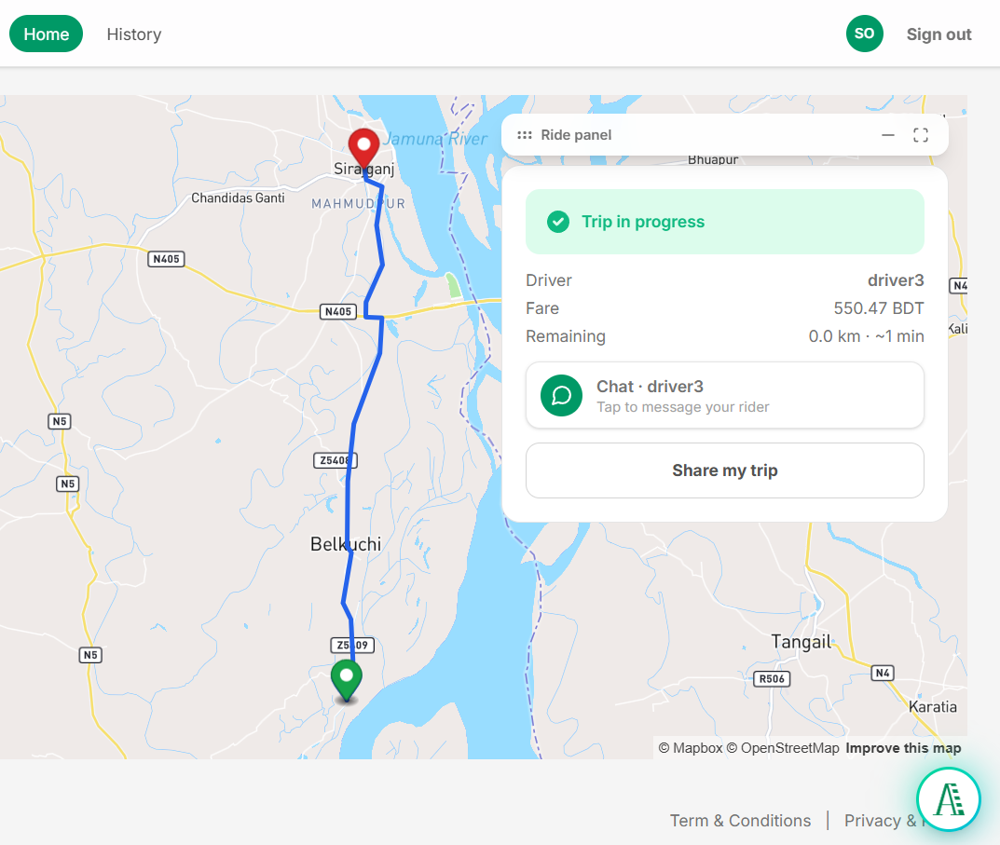
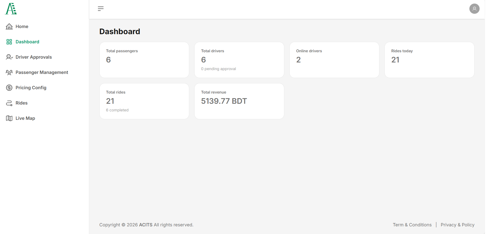
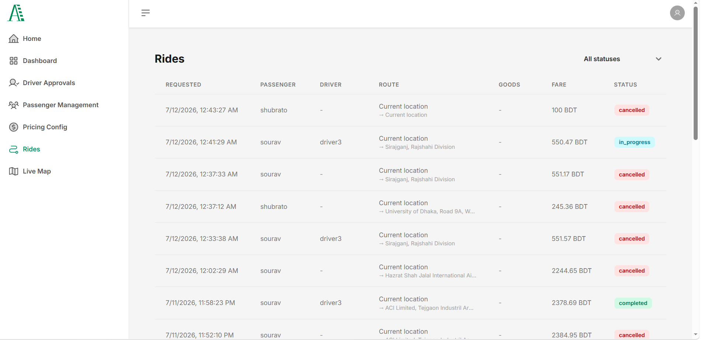
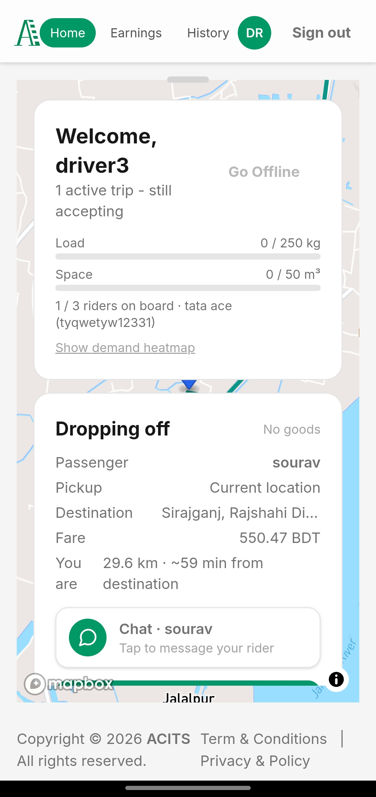
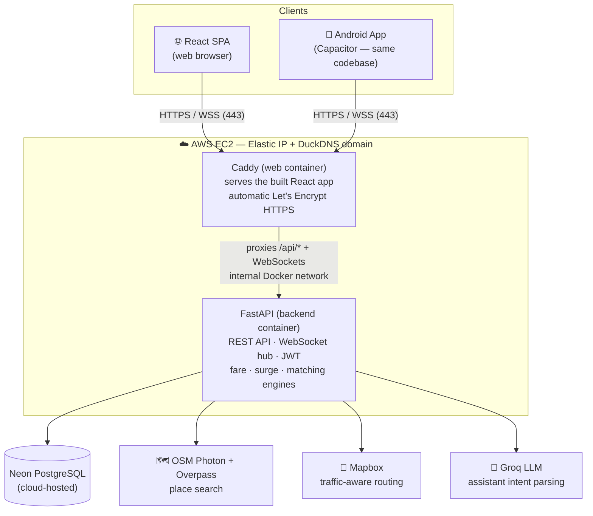
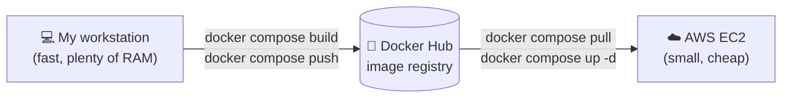

<div align="center">

# ACITS — Ride Sharing & Pooled Cargo Platform

**A full-stack, production-deployed ride-sharing platform for Bangladesh with live GPS tracking, pooled truck cargo matching, surge pricing, an AI ride assistant, a full admin control panel, and a native Android app.**


[](https://acits.duckdns.org)
[](#-android-app-capacitor)


</div>

---

## 📌 Table of Contents

- [Key Functionality](#-key-functionality)
- [Live Demo](#-live-demo)
- [Screenshots](#-screenshots)
- [Tech Stack](#-tech-stack)
- [System Architecture](#-system-architecture)
- [Development Phases](#-development-phases)
- [AWS Deployment (with HTTPS)](#-aws-deployment-with-https)
- [Android App (Capacitor)](#-android-app-capacitor)
- [API Overview](#-api-overview)
- [Running Locally](#-running-locally)
- [Testing](#-testing)
- [Project Structure](#-project-structure)
- [What This Project Demonstrates](#-what-this-project-demonstrates)

---

## ⚡ Key Functionality

The platform serves **three roles** — Passenger, Driver, and Administrator — from one codebase, on both the web and a native Android app.

### 🧍 Passenger
- **Book a ride on a live map** — pick your location with GPS, search any destination in Bangladesh, or tap a point directly on the map.
- **Smart place search** — powered by OpenStreetMap (Photon) with an automatic Mapbox fallback, strictly limited to places inside Bangladesh.
- **Upfront fare estimate** — distance, duration, and full fare breakdown shown **before** you confirm, calculated on the server so it cannot be tampered with.
- **Pooled cargo (goods) rides** — travelling with goods? Enter the weight (kg) and volume (m³) and the system matches you with a pickup truck that has enough remaining capacity, sharing the vehicle with other cargo when possible.
- **Schedule rides for later** — book now, ride at a chosen future time.
- **Live driver tracking** — watch your driver approach in real time over WebSockets, with a traffic-aware ETA.
- **In-ride chat** — message your driver directly inside the app.
- **AI ride assistant** — a floating chat assistant ("find the nearest pharmacy", "where is Khwaja Yunus Ali Medical College") that finds real places and starts the booking for you with one tap. The assistant panel is draggable, minimizable, and expandable.
- **Ratings & history** — rate every ride and browse your full ride history.
- **Ride sharing link** — share a live ride status link with family so they can follow the trip.

### 🚗 Driver
- **Online/offline toggle** with continuous GPS location heartbeat.
- **Broadcast ride requests** — nearby requests appear instantly; the first driver to accept wins the ride (race-style matching, like real ride-hailing apps).
- **Route preview before accepting** — see the traffic-optimized route to the pickup point *before* committing to a ride.
- **Live turn-by-turn route line** to the pickup and then the destination, refreshed with live traffic data.
- **Demand heatmap** — see where ride requests are concentrated right now.
- **Earnings dashboard** — daily and total earnings, completed ride counts.
- **Vehicle profile** — car, bike, or pickup truck with cargo capacity for pooled goods rides.

### 🛠️ Administrator
- **Dashboard** with platform-wide statistics.
- **Live Ops map** — watch every active ride and online driver on one screen in real time.
- **Driver approval workflow** — review and approve or suspend drivers before they can take rides.
- **Passenger management** — activate or suspend accounts.
- **Ride management** — filter and inspect every ride on the platform.
- **Pricing control panel** — edit base fare, per-km / per-minute rates, peak-hour and night multipliers, and surge settings live, with no redeploy.

### ⚙️ Platform-Level
- **Surge pricing engine** — fares respond to the live demand/supply ratio in each zone.
- **JWT authentication** with role-based access control, password reset over email, and rate limiting on sensitive endpoints.
- **Single WebSocket channel** carrying every realtime topic (ride status, driver location, chat, admin live ops) with per-topic authorization.
- **Fully containerized** — one `docker compose up -d` starts the entire production stack.

---

## 🌐 Live Demo

| | |
|---|---|
| **Web App** | https://acits.duckdns.org |
| **Admin Panel** | https://acits.duckdns.org/admin |
| **API Health** | https://acits.duckdns.org/api/v1/health |
| **Android APK** | built with Capacitor — see [Android App](#-android-app-capacitor) |

> The demo runs on a real AWS EC2 instance with real HTTPS. It is not a mock or a localhost recording.

---

## 📸 Screenshots

> All images live in [`docs/screenshots/`](docs/screenshots/).

### Passenger — booking and live tracking

| Booking a ride | Live driver tracking |
|---|---|
|  |  |

### AI assistant and the driver's route preview

| AI assistant finds real places | Driver route preview before accepting |
|---|---|
|  |  |

### Admin panel

| Dashboard | Live Ops — every ride and driver, live |
|---|---|
|  |  |

### Android app

<p align="center">
  
</p>

---

## 🧰 Tech Stack

### Frontend
| Technology | Role |
|---|---|
| **React 19 + Vite 7** | SPA with fast builds and hot reload |
| **Tailwind CSS** | Utility-first, fully responsive styling |
| **react-map-gl + Mapbox GL JS** | Interactive live maps, markers, route lines |
| **Framer Motion** | Draggable/minimizable panels, smooth animations |
| **Zustand** | Lightweight global state |
| **SWR** | Data fetching with caching and revalidation |
| **Zod** | Client-side form validation matching backend rules |
| **Capacitor 8** | Wraps the same codebase into a native Android app |

### Backend
| Technology | Role |
|---|---|
| **FastAPI (async Python)** | REST API + WebSocket realtime layer |
| **PostgreSQL (Neon, cloud-hosted)** | Primary database |
| **SQLAlchemy 2 + Alembic** | ORM and versioned schema migrations |
| **Pydantic v2** | Strict request/response validation |
| **JWT (access tokens)** | Stateless authentication with role claims |
| **pytest** | Unit and lifecycle test suite |

### Maps & Geo Intelligence
| Technology | Role |
|---|---|
| **OpenStreetMap / Photon** | Primary place search — denser Bangladesh coverage than commercial datasets, free, no API key |
| **Overpass API** | Category searches ("nearest pharmacy") on OSM data |
| **Mapbox Directions (driving-traffic)** | Traffic-aware routing, ETAs, and fare distance |
| **Mapbox Search Box** | Automatic fallback when OSM is unavailable |
| **Geohash-based proximity** | Efficient nearby-driver lookups |

### AI
| Technology | Role |
|---|---|
| **Groq (Llama 3.3 70B)** | Intent parsing for the ride assistant — the model only parses what the user wants; **real coordinates always come from real geocoders**, so it can never invent an address |

### Infrastructure & DevOps
| Technology | Role |
|---|---|
| **Docker + Docker Compose** | Every service containerized; one file drives both local build and server run |
| **Docker Hub** | Image registry — build on a workstation, pull on the server |
| **AWS EC2 + Elastic IP** | Production host with a stable public IP |
| **Caddy 2** | Web server, reverse proxy, and **automatic HTTPS** (Let's Encrypt) |
| **DuckDNS** | Free domain pointing at the Elastic IP |
| **Neon** | Serverless PostgreSQL, separate from the app host |

---

## 🏗 System Architecture



**Design decisions worth noting:**

- **Fares are computed only on the server.** The client never sends a price — it sends coordinates, and the backend calls the routing engine and applies the fare rules. A malicious client cannot lower its own fare.
- **Search and routing are deliberately split.** Place *search* uses OpenStreetMap (better local coverage in Bangladesh, free). Route *calculation* uses Mapbox's `driving-traffic` profile (live traffic data). Each provider does what it is best at, and each has an automatic fallback.
- **Broadcast/race matching instead of central dispatch.** Ride requests are broadcast to nearby online drivers and the first acceptance wins — the same model used by major ride-hailing apps, and it stays responsive with zero matching bottleneck.
- **One WebSocket, many topics.** A single authenticated socket carries ride status, driver locations, chat, and admin live-ops feeds. Every topic subscription is authorized per user, so a passenger can never listen to someone else's ride.
- **Pooled cargo capacity is a pure, tested service.** Truck capacity (kg / m³) is tracked in an isolated `capacity_service` with its own unit tests, so overbooking a truck is impossible.

---

## 🗂 Development Phases

The project was built in deliberate phases, each one shipped and verified before moving to the next.

### Phase 1 — Foundations
- FastAPI project skeleton, configuration management, health checks.
- React app structured with config-driven routing and role-based route guards (`PASSENGER`, `DRIVER`, `ADMIN`).
- Authentication: signup, signin, JWT issuance, password hashing, forgot/reset password over email.

### Phase 2 — Passenger Core Flow
- Live Mapbox map with GPS pickup detection and tap-to-set fallback.
- Destination search with autocomplete.
- Server-side route + fare estimation with a full fare breakdown shown before booking.

### Phase 3 — Matching & the Driver Side
- Driver online/offline status and GPS heartbeat with geohash indexing.
- Broadcast ride requests to nearby drivers; first-accept-wins race matching.
- Driver route preview before accept, live traffic-optimized route after accept.

### Phase 4 — Realtime Layer
- Single WebSocket endpoint with per-topic authorization.
- Live driver tracking for passengers, live ride status transitions, in-ride chat.
- Admin Live Ops: every active ride and driver on one realtime map.

### Phase 5 — Pooled Cargo & Pricing Engine
- Goods rides: weight/volume input, truck capacity ledger, pooled matching.
- Fare rules stored in the database and editable live from the admin panel.
- Surge pricing from the live demand/supply ratio; peak-hour and night multipliers computed in Asia/Dhaka time.

### Phase 6 — Admin Panel
- Dashboard statistics, driver approval workflow, passenger management, ride management with filters, pricing configuration UI.

### Phase 7 — Geo Upgrade & AI Assistant
- Switched place search to OpenStreetMap (Photon + Overpass) for far denser Bangladesh coverage, keeping Mapbox as automatic fallback and for traffic routing.
- Built the AI ride assistant: LLM parses intent only; real geocoders resolve real places; one tap hands the destination to the booking flow.
- Country-restricted every search path to Bangladesh.

### Phase 8 — Production Deployment (AWS)
- Containerized both services with multi-stage Docker builds.
- Deployed on AWS EC2 with Elastic IP, DuckDNS domain, and automatic HTTPS via Caddy.
- Set up the local-build → Docker Hub → server-pull release workflow.
- *(Full write-up in the [AWS Deployment](#-aws-deployment-with-https) section below.)*

### Phase 9 — Android App
- Wrapped the same frontend with Capacitor into a native Android APK.
- Build-time API base URL switching (relative `/api` on web, absolute HTTPS URL in the APK).
- Native GPS permission flow; entire build done from the command line — no Android Studio required.

### Phase 10 — Hardening & Polish
- Rate limiting, listener scoping, aggregate admin queries, self-cleaning background sweeps.
- Draggable / minimizable / expandable map panels sized for real phone screens.
- Profile cards for all three roles wired to live database stats.
- Test suite covering fares, capacity, geohash, auth, rate limits, realtime, and the full ride lifecycle.

---

## ☁️ AWS Deployment (with HTTPS)

> This section documents, step by step, exactly how the platform went from `localhost` to a public HTTPS product on AWS. The result: **the app runs 24/7 on the internet even when my own computer is off.**

### 1. Provisioning the EC2 instance

- Launched an **Ubuntu EC2 instance** in `us-east-1`.
- Generated an SSH **key pair** and connected using key-based auth only — no passwords.
- Configured the **security group** with least-privilege inbound rules:

| Port | Purpose | Source |
|---|---|---|
| 22 (SSH) | Server administration | My ISP's CIDR range only |
| 80 (HTTP) | Let's Encrypt challenge + redirect to HTTPS | Anywhere |
| 443 (TCP + UDP) | HTTPS and HTTP/3 traffic | Anywhere |

> A real-world problem solved here: my ISP uses **CGNAT**, so my public IP changes frequently. Locking SSH to a single IP kept breaking access. The fix was scoping the SSH rule to the ISP's `/24` block — still far tighter than `0.0.0.0/0`, but stable across IP rotations.

### 2. A stable address: Elastic IP + DuckDNS

- Allocated an **AWS Elastic IP** and associated it with the instance, so the server's public IP never changes across restarts.
- Pointed a free **DuckDNS** domain (`acits.duckdns.org`) at that Elastic IP.

This gives a permanent, memorable URL without buying a domain — and a real domain is what makes real HTTPS certificates possible.

### 3. Automatic HTTPS with Caddy + Let's Encrypt

Instead of manually managing certificates with certbot and nginx, the frontend container runs **Caddy**:

```caddyfile
{$SITE_ADDRESS}          # acits.duckdns.org in production

handle /api/* {
    reverse_proxy backend:8000   # REST + WebSockets, Upgrade header passed through
}

handle {
    root * /srv
    try_files {path} /index.html # SPA fallback for client-side routes
    file_server
}
```

What Caddy does automatically with this tiny config:

- **Obtains a Let's Encrypt certificate** for the domain on first boot (HTTP-01 challenge over port 80).
- **Renews it forever** — zero cron jobs, zero manual steps.
- **Redirects all HTTP to HTTPS.**
- Serves **HTTP/3** over UDP 443.
- Proxies API and **WebSocket** traffic to the backend container over Docker's internal network — the backend is never exposed to the internet directly.

Certificates are stored on a **named Docker volume**, so container restarts never re-request certificates (Let's Encrypt has strict rate limits — this detail matters).

### 4. The Docker release pipeline: build locally, pull on the server

The EC2 instance is a small, cheap machine (~1 GB RAM). The frontend's Vite build **out-of-memoried** the server every time. Rather than paying for a bigger instance, I inverted the workflow:



One `docker-compose.yml` declares **both** `build:` and `image:` for each service, so the exact same file drives both sides:

**On the workstation (release):**
```bash
docker compose build     # multi-stage builds: Node build stage → Caddy runtime; Python slim
docker compose push      # push both images to Docker Hub
```

**On the server (deploy):**
```bash
git pull                 # only for compose/env changes
docker compose pull      # pull the new images
docker compose up -d     # recreate containers, ~seconds of downtime
```

Extra production details handled along the way:

- **Multi-stage Dockerfiles** keep the final images small — the web image contains only Caddy plus the built static files, none of `node_modules`.
- The backend container runs `alembic upgrade head` before starting, so **database migrations apply themselves** on every deploy.
- Added **swap** on the instance and tuned Node's heap (`NODE_OPTIONS=--max-old-space-size`) — and documented why V8's memory heuristic misreads containers on small hosts.
- `restart: unless-stopped` on every service, so the whole stack **survives server reboots** unattended.

### 5. Separating the database from the host

The database is **Neon serverless PostgreSQL**, not a container on the EC2 box. This means:

- The 1 GB instance spends its memory on the app, not on Postgres.
- Data survives even if the EC2 instance is terminated.
- Backups, connection pooling, and TLS to the database are managed by the database platform.

### 6. Production configuration hygiene

- All secrets live in `.env` files **on the server only** — never committed. `.env.example` files document every variable.
- Separate production `JWT_SECRET_KEY` and admin password, different from development.
- CORS locked to the production origin.
- The Android release-keystore patterns are git-ignored **before** any keystore exists — a leaked signing key can never be rotated, so this is guarded proactively.

### The result

```
https://acits.duckdns.org        → valid Let's Encrypt certificate, A-grade TLS, HTTP/3
https://acits.duckdns.org/api/…  → FastAPI over the same certificate
wss://acits.duckdns.org/api/v1/ws → secure WebSockets for realtime
```

A phone anywhere in the world can install the APK and book a ride — my computer can be off.

---

## 📱 Android App (Capacitor)

The same React codebase ships as a native Android app — no separate mobile codebase.

**How it works:**

- `npm run build:apk` builds the web bundle in "capacitor mode", where the API base URL switches from the relative `/api` (web) to the absolute production URL `https://acits.duckdns.org/api` (APK), then runs `npx cap sync android`.
- `./gradlew assembleDebug` produces the APK — the **entire build is command-line**; Android Studio is never opened.

```bash
cd frontend
npm run build:apk                # Vite build (capacitor mode) + cap sync
cd android && ./gradlew assembleDebug
# → android/app/build/outputs/apk/debug/app-debug.apk
```

**Native integration:**

- `ACCESS_FINE_LOCATION` / `ACCESS_COARSE_LOCATION` permissions with the standard Android runtime permission prompt, handled through Capacitor's bridge and the `@capacitor/geolocation` plugin.
- All map panels are draggable, minimizable, and expandable — designed for real phone screens, from medium to large.
- The APK talks to the live HTTPS backend, so it works on any network.

---

## 🔌 API Overview

All endpoints live under `/api/v1`. A sample of the surface:

| Area | Endpoints |
|---|---|
| **Auth** | `POST /auth/signup` · `POST /auth/signin` · `POST /auth/forgot-password` · `POST /auth/reset-password` |
| **Rides** | `POST /rides` · `GET /rides/active` · `GET /rides/history` · `POST /rides/{id}/accept` · `/start` · `/complete` · `/cancel` · `/rate` · ride chat messages |
| **Routing** | `POST /routes/estimate` (fare + route) · `POST /routes/eta` (traffic-aware ETA + path) |
| **Drivers** | `POST /drivers/status` · `POST /drivers/location` · `GET /drivers/heatmap` · `GET /drivers/earnings` · `POST /drivers/vehicle` |
| **Assistant** | `POST /assistant/chat` (AI place search, Bangladesh-restricted) |
| **Users** | `GET /users/me` (role-aware profile with live ride stats) |
| **Admin** | login · drivers approval · passengers · rides · live rides · `GET/PUT /admin/pricing` · dashboard stats |
| **Realtime** | `WS /ws` — one authenticated socket for ride status, locations, chat, live ops |

Interactive API docs (Swagger UI) are auto-generated by FastAPI at `/docs` when running locally.

---

## 💻 Running Locally

**Prerequisites:** Node 20+, Python 3.12+, and a PostgreSQL database (a free Neon project works).

```bash
# 1. Clone
git clone https://github.com/modhudeb/ACITS-Ride-Sharing-App.git
cd ACITS-Ride-Sharing-App

# 2. Backend
cd backend
python -m venv .venv && source .venv/bin/activate   # .venv\Scripts\activate on Windows
pip install -r requirements.txt
cp .env.example .env        # fill in DATABASE_URL, JWT_SECRET_KEY, MAPBOX_TOKEN, GROQ_API_KEY, ...
alembic upgrade head
python seed_demo_data.py    # demo passenger, driver, admin + fare rules

# 3. Frontend
cd ../frontend
npm install
cp .env.example .env        # set VITE_MAPBOX_TOKEN

# 4. Run both (from the repo root)
python run.py               # or run uvicorn and `npm run dev` separately
```

Or run the whole stack exactly like production:

```bash
docker compose build
docker compose up -d        # web on :80, API proxied at /api
```

---

## 🧪 Testing

```bash
cd backend
pytest
```

The suite covers the parts where a bug costs money or trust:

| Test file | What it protects |
|---|---|
| `test_fare_service.py` | Fare math, peak/night windows, surge multipliers |
| `test_capacity_service.py` | Pooled truck capacity — overbooking is impossible |
| `test_ride_lifecycle.py` | Every legal (and illegal) ride status transition |
| `test_auth.py` | Signup/signin, token handling, role enforcement |
| `test_rate_limit.py` | Abuse protection on sensitive endpoints |
| `test_realtime.py` | WebSocket topic authorization |
| `test_geohash.py` | Proximity encoding for driver matching |

---

## 📁 Project Structure

```
├── docker-compose.yml          # One file: local build+push AND server pull+run
├── backend/
│   ├── Dockerfile              # Python slim; runs migrations, then uvicorn
│   ├── app/
│   │   ├── api/v1/             # auth, rides, drivers, routes, admin, assistant, users, ws
│   │   ├── core/               # config, security (JWT), realtime hub, rate limiting
│   │   ├── db/                 # SQLAlchemy models + session
│   │   ├── models/             # Pydantic request/response schemas
│   │   └── services/           # fare, surge, capacity, maps, assistant, geohash, email
│   ├── migrations/             # Alembic versioned schema
│   └── tests/                  # pytest suite
└── frontend/
    ├── Dockerfile              # Multi-stage: Node build → Caddy runtime
    ├── Caddyfile               # Auto-HTTPS, SPA fallback, /api + WS proxy
    ├── android/                # Capacitor-generated native Android project
    └── src/
        ├── views/              # passenger / driver / admin / auth / rides
        ├── components/         # shared UI: map layers, chat, assistant, panels
        ├── services/           # axios API layer
        ├── auth/               # session + role handling
        └── utils/hooks/        # ride listeners, driver ETA, live locations
```

---

## 🎯 What This Project Demonstrates

- **Full-stack ownership** — database schema, async API, realtime layer, responsive UI, native mobile wrap, and cloud infrastructure, all built and connected by one person.
- **Real production deployment** — not a tutorial deploy: a live AWS server with automatic HTTPS, a registry-based release pipeline, self-applying migrations, and an app that stays up unattended.
- **Pragmatic engineering trade-offs** — OSM for search where commercial data is weak, Mapbox for traffic routing where it is strong; build images on the workstation because the server is small; broadcast matching because central dispatch adds no value at this scale.
- **Security thinking** — server-side fares, per-topic WebSocket authorization, least-privilege firewall rules, secret hygiene, rate limiting, and protecting the Android signing key before it even exists.
- **Domain depth** — surge pricing in the local timezone, pooled cargo capacity ledgers, and country-restricted geocoding are the kind of details real products need.

---

<div align="center">

**Built by [Modhu Deb](https://github.com/modhudeb)**

*ACITS — Advanced Cargo & Intelligent Transport System*

</div>
